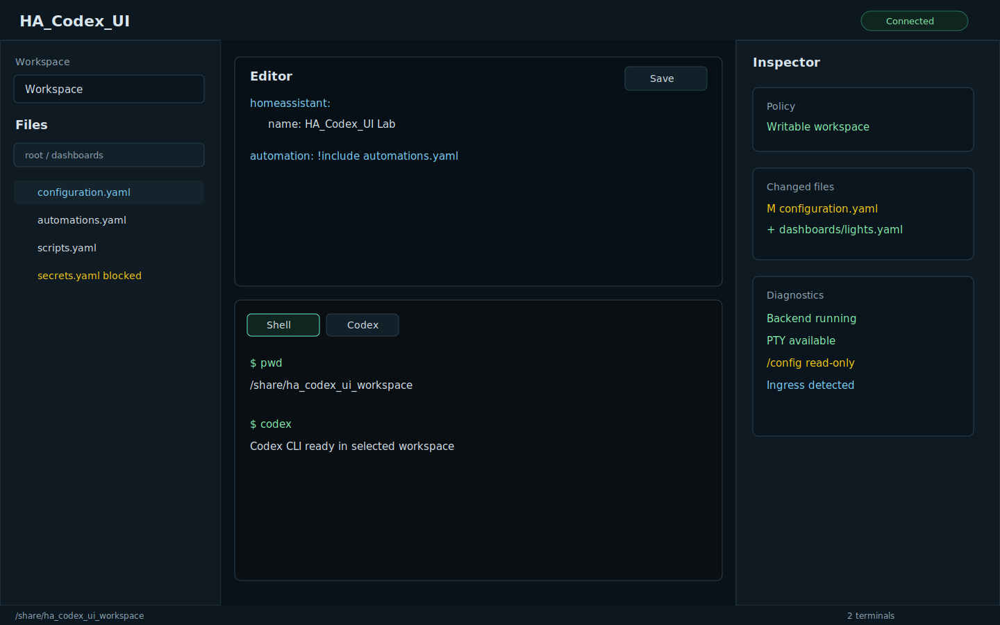

# HA_Codex_UI

HA_Codex_UI is a Home Assistant add-on repository for a secure Ingress web app that provides a browser-based file manager, editor, multi-terminal workspace, Codex CLI launcher, changed-file inspector, diffs, snapshots, diagnostics, and Home Assistant-focused guardrails.

Terminals and Codex sessions are powerful. They can run commands and modify any workspace that is mounted read-write. The default add-on configuration keeps `/config`, `/addons`, and `/backup` read-only, and uses `/share/ha_codex_ui_workspace` plus `/share/ha_codex_ui_uploads` for write workflows.

[](https://my.home-assistant.io/redirect/supervisor_add_addon_repository/?repository_url=https%3A%2F%2Fgithub.com%2Fresace3%2FHA_Codex_UI)

<a href="https://my.home-assistant.io/redirect/supervisor_add_addon_repository/?repository_url=https%3A%2F%2Fgithub.com%2Fresace3%2FHA_Codex_UI">
  
</a>

The button opens your Home Assistant instance and pre-fills this repository URL.

## Local Execution Policy

Files are generated locally. Project execution is intentionally delegated to GitHub Actions. Tests, builds, Docker, devcontainer checks, browser rendering checks, package installation, security scans, and Home Assistant smoke checks run remotely after the repository is pushed.

Generated scripts in `scripts/` and `.devcontainer/` refuse to run unless `GITHUB_ACTIONS=true`.

## Features

- Home Assistant sidebar launch through Ingress.
- Ingress-aware HTTP and WebSocket routing.
- Allowed workspace browser.
- File upload and download.
- Folder zip download.
- Text file editing with save policy checks.
- New file, new folder, rename, and delete API support.
- Multiple live PTY terminals.
- Codex CLI terminal sessions with isolated Codex home.
- Live terminal output streaming and reconnect after browser refresh.
- Terminal resize, input, stop, close, and metadata persistence.
- Changed-file inspection through git or snapshots.
- Snapshot creation and file-level restore.
- YAML checks.
- Home Assistant config check endpoint that reports unsupported when safe execution is unavailable.
- Diagnostics for health, mounts, workspaces, Codex, git, PTY, WebSocket, Ingress, Node, platform, snapshots, and safety policy.
- Responsive mobile layout for Home Assistant mobile app use.

## Screenshots

[](https://my.home-assistant.io/redirect/supervisor_add_addon_repository/?repository_url=https%3A%2F%2Fgithub.com%2Fresace3%2FHA_Codex_UI)

Browser rendering workflows also upload screenshots and traces as GitHub Actions artifacts when failures occur.

## Install Option 1: GitHub Add-on Repository

1. Push this repository to the public GitHub repository `resace3/HA_Codex_UI`.
2. Click the install button above, or add the repository URL in the Home Assistant add-on store.
3. Install **HA_Codex_UI**.
4. Review add-on options.
5. Start the add-on.
6. Open **HA_Codex_UI** from the Home Assistant sidebar.

Repository URL:

```text
https://github.com/resace3/HA_Codex_UI
```

## Install Option 2: Verified Actions Artifacts

1. GitHub Actions builds and validates artifacts remotely.
2. Download verified artifacts from the Actions run.
3. Copy the verified `ha_codex_ui` add-on folder into a Home Assistant local add-ons directory.
4. Reload the Home Assistant add-on store.
5. Install local **HA_Codex_UI**.
6. Start the add-on.
7. Open it from the sidebar.

## Install Option 3: Devcontainer In GitHub Actions

1. GitHub Actions builds the devcontainer.
2. GitHub Actions validates the local add-on structure.
3. GitHub Actions attempts Home Assistant and Supervisor smoke diagnostics.
4. GitHub Actions uploads logs and summaries.

## Configuration

| Option | Default | Notes |
| --- | --- | --- |
| `default_workspace` | `/share/ha_codex_ui_workspace` | Main writable workspace. |
| `upload_workspace` | `/share/ha_codex_ui_uploads` | Default upload target. |
| `allowed_workspaces` | Workspace, uploads, `/config` | Only configured roots are visible. |
| `allow_config_write` | `false` | Keeps `/config` read-only by default. |
| `allow_addons_write` | `false` | Keeps `/addons` read-only. |
| `allow_backup_write` | `false` | Keeps `/backup` read-only. |
| `allow_shell` | `true` | Enables shell terminal sessions. |
| `allow_codex` | `true` | Enables Codex terminal sessions. |
| `allow_file_upload` | `true` | Enables uploads to writable workspaces. |
| `allow_file_download` | `true` | Enables downloads except blocked sensitive paths. |
| `max_upload_mb` | `50` | Upload size cap. |
| `max_terminal_sessions` | `8` | Live terminal cap. |
| `terminal_idle_timeout_minutes` | `120` | Idle cleanup window. |
| `codex_install_mode` | `bundled` | Runtime image includes Codex CLI. |
| `codex_home` | `/data/ha_codex_ui/.codex` | Isolated Codex state. |
| `create_snapshot_before_write` | `true` | Captures snapshots before app writes. |

## Workspaces

HA_Codex_UI only serves configured absolute workspace roots. Missing default and upload workspaces are created at startup when policy allows it. Sensitive roots such as `/config`, `/addons`, and `/backup` are marked sensitive and read-only by default.

## Uploads And Downloads

Uploads stream to a temporary file before rename, enforce size limits, and require write policy approval. Downloads block sensitive files, Codex auth files, SSH and GnuPG state, token-like files, browser credential stores, and `secrets.yaml`. Folder downloads are zipped with zip-slip protections and the same denylist.

## Terminals

Shell terminals launch `bash` in the selected workspace. Codex terminals launch `codex` with:

```text
CODEX_HOME=/data/ha_codex_ui/.codex
HOME=/data/ha_codex_ui
```

Terminal output is streamed to the browser. Raw terminal logs are not persisted by default.

## Codex Authentication

HA_Codex_UI never asks for an OpenAI username or password and never displays Codex auth file contents. Sign in through a Codex terminal session. If authentication files are detected, the UI reports only a safe state such as `likely_authenticated`.

## Diffs And Snapshots

Git workspaces use `git status` and `git diff`. Non-git workspaces can use snapshots under `/data/ha_codex_ui/snapshots`. Snapshots skip `.git`, `node_modules`, secrets, large files, binary files, and Codex state.

## Home Assistant Checks

YAML parsing is supported for selected files. Full Home Assistant configuration checks return `supported: false` unless a safe supported endpoint or command exists in the add-on context. HA_Codex_UI does not fake success.

## Mobile Notes

The mobile layout uses tabs for Files, Terminal, Inspector, and Settings. Terminal input, upload controls, download controls, editor content, and dialogs are sized for common phone widths.

## Security Model

- Ingress-first access.
- No public port exposure required.
- No `full_access`.
- No host networking.
- No Docker socket.
- No privileged add-on mode.
- Sensitive Home Assistant folders are read-only by default.
- Path traversal, absolute escape, symlink escape, Codex state, auth files, SSH keys, GnuPG state, browser credentials, token-like files, and `secrets.yaml` are blocked.
- Structured logs redact tokens and secret-like values.
- GitHub Actions run secret scans, CodeQL, npm audit, Trivy, linting, name collision checks, and remote-only guard checks.

## CI Workflows

The workflow suite covers repository validation, add-on metadata validation, backend lint/typecheck/tests, frontend lint/typecheck/tests/build, PTY tests, file manager tests, browser rendering, Docker builds, Home Assistant local install smoke attempts, devcontainer smoke, security scans, release builds, lockfile bootstrap, name collision checks, and remote-only guard validation.

## Release Process

Releases are built in GitHub Actions. The release workflow validates the add-on, runs safety checks, builds multi-arch images, publishes `ghcr.io/resace3/ha-codex-ui`, and uploads scan results where supported.

## Troubleshooting

- If the sidebar panel does not load, inspect the browser rendering workflow and add-on logs.
- If Codex is not authenticated, open a Codex terminal and complete the CLI sign-in flow.
- If `/config` cannot be edited, that is the default safe behavior.
- If full Home Assistant config checks are unavailable, use YAML checks and downloadable patch workflows.
- If lockfiles need updates, use the lockfile bootstrap workflow.

## Known Limitations

- Codex auth must be completed by the user.
- PTY sessions survive browser refresh, but not add-on restart unless tmux persistence is added later.
- Full Home Assistant config check depends on available Home Assistant and Supervisor APIs.
- App-level write policy protects sensitive paths, but terminal access is still powerful in writable workspaces.
- `/config` is read-only by default.
- Do not expose this add-on publicly.
- `armv7` support would require additional testing.
- Codex CLI install methods may change over time.
- HA_Codex_UI naming is intentional to avoid conflicts with a separate similar add-on.
- Initial lockfiles may need GitHub Actions bootstrap because local package manager execution is disabled.

## Name Collision Avoidance

The repository includes a dedicated scanner that prevents accidental reintroduction of legacy project naming outside the scanner itself. Product, package, add-on, image, and documentation names should remain HA_Codex_UI, `ha_codex_ui`, `ha-codex-ui`, and `ghcr.io/resace3/ha-codex-ui` as appropriate.
